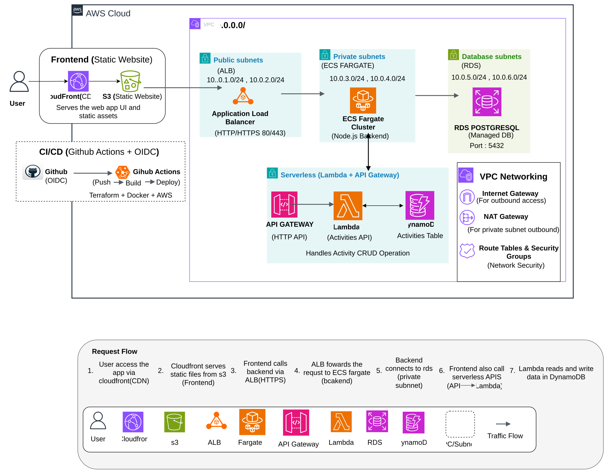
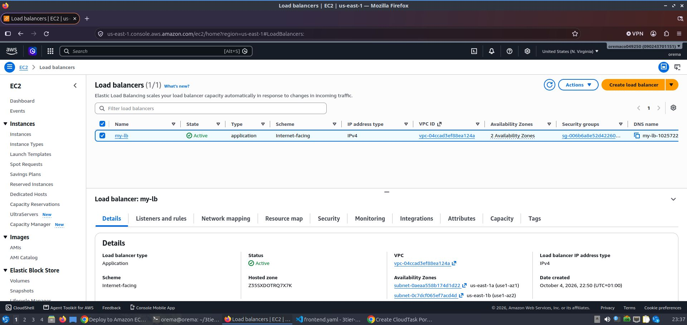
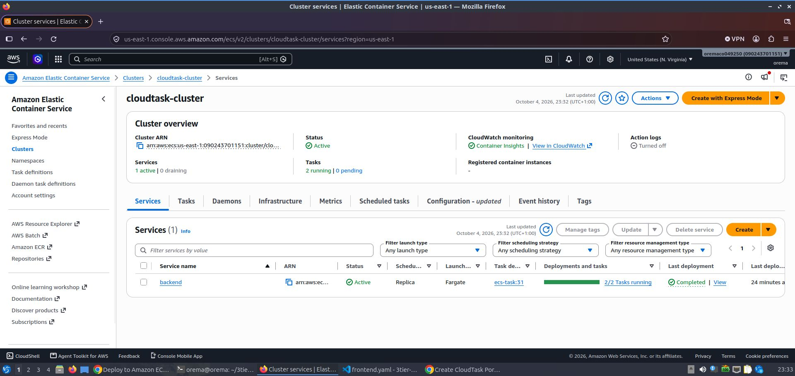
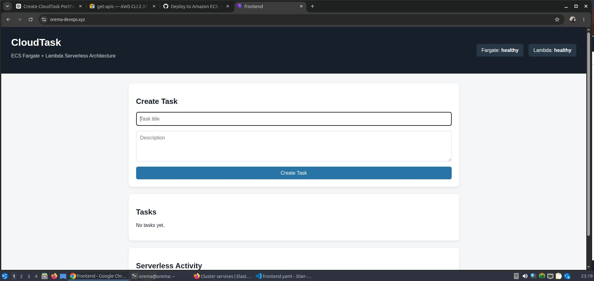
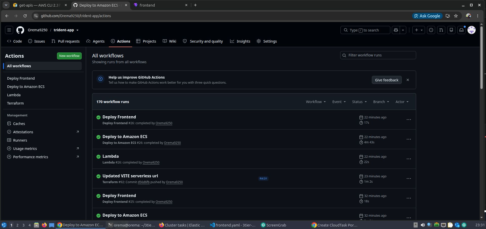
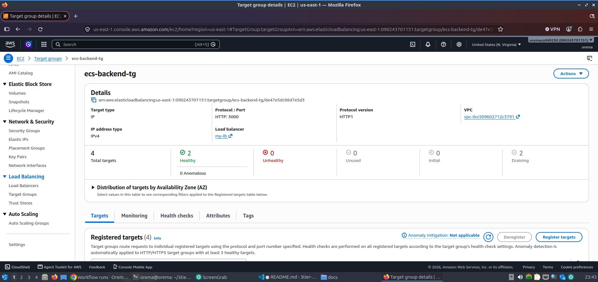
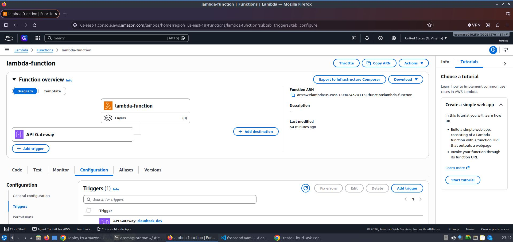
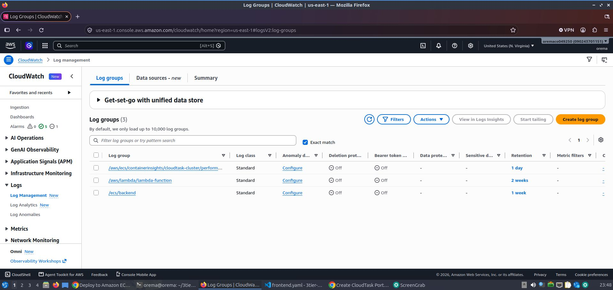

# CloudTask

A cloud-native task management application built on AWS using **ECS Fargate, Lambda, API Gateway, RDS PostgreSQL, DynamoDB, S3, CloudFront, Terraform, Docker, and GitHub Actions**.

## Architecture



### Architecture Overview

CloudTask uses two application paths:

- **Containerized path:** Route 53 → ALB → ECS Fargate → RDS PostgreSQL
- **Serverless path:** API Gateway → Lambda → DynamoDB
- **Frontend delivery:** CloudFront → S3

The ECS application handles the main task-management workload, while the
serverless component provides a separate API backed by DynamoDB.
---


## Project Overview

CloudTask was built as a hands-on cloud engineering project to practice designing, deploying, securing, and troubleshooting a multi-service AWS environment.

The goal was not simply to provision AWS resources with Terraform. I wanted to understand what happens when the system breaks.

During development I encountered issues across **ECS, ALB health checks, PostgreSQL connectivity, Secrets Manager, Lambda, API Gateway, IAM, Terraform, and CI/CD**. I investigated these failures using AWS logs, service events, CloudTrail, Terraform output, and IAM Access Analyzer.

The result is a working application backed by reproducible infrastructure and a documented troubleshooting history .

## Key areas demonstrated:

* AWS networking and multi-tier architecture
* Docker and ECS Fargate
* Serverless workloads with Lambda and API Gateway
* RDS PostgreSQL and DynamoDB
* Terraform Infrastructure as Code
* GitHub Actions with AWS OIDC
* IAM least privilege
* Cloud troubleshooting and incident investigation

[→ View the CloudTask Troubleshooting Journal](docs/troubleshooting.md)
---


## What I built

### Application

* Node.js / Express backend
* Dockerized application
* Task management API
* Application and database health endpoints
* Lambda-based serverless API
* DynamoDB-backed operations
* PostgreSQL-backed application data

### AWS Infrastructure

* VPC
* Public, private application, and database subnets
* Application Load Balancer
* ECS Fargate
* ECR
* RDS PostgreSQL
* Lambda
* API Gateway
* DynamoDB
* S3
* CloudFront
* Route 53
* Secrets Manager
* CloudWatch

### DevOps & Security

* Terraform Infrastructure as Code
* Docker
* GitHub Actions
* GitHub OIDC federation
* IAM least privilege
* CloudTrail
* IAM Access Analyzer

---
## Key Engineering Decisions

### GitHub OIDC instead of long-lived AWS credentials

GitHub Actions authenticates to AWS using OIDC federation and an IAM role rather than storing permanent AWS access keys as GitHub secrets.

### Private ECS workloads

The ECS tasks run in private application subnets and receive traffic through the Application Load Balancer.

### Secrets Manager for database credentials

Database credentials are stored in AWS Secrets Manager rather than being hard-coded into the application or Terraform configuration.

### Terraform for infrastructure

AWS resources are managed through Terraform so that infrastructure changes are reviewable and reproducible.

### Separate container and serverless workloads

The project deliberately uses both ECS Fargate and Lambda to demonstrate different AWS compute models and understand where each architecture fits.

### Evidence-driven troubleshooting

When failures occurred, I used service events, logs, CloudTrail, Terraform output, and IAM Access Analyzer to identify the failing component before making changes.


---
## CI/CD

GitHub Actions handles the deployment workflow.

```text
GitHub
   ↓
GitHub Actions
   ↓
AWS OIDC
   ↓
IAM Role
   ↓
Terraform / ECR
   ↓
AWS Infrastructure
   ↓
ECS / Lambda
```

I used **GitHub OIDC instead of storing long-lived AWS access keys in GitHub**.

Terraform manages the AWS infrastructure, while Docker images are built and pushed to ECR before being deployed to ECS.

---

## Security

Security was considered as part of the architecture rather than added afterwards.

Some of the main controls include:

* ECS workloads running in private subnets
* RDS isolated in database subnets
* Database credentials stored in AWS Secrets Manager
* IAM roles instead of hard-coded AWS credentials
* GitHub Actions authenticated using OIDC
* Least-privilege IAM policies
* Security groups controlling communication between tiers
* CloudWatch logging for application troubleshooting
* CloudTrail used to investigate AWS API activity

---

## Troubleshooting

This project involved several real deployment and configuration problems.

One of the most useful lessons was learning to **find the first broken layer instead of changing random configuration**.

For example, when the backend was unavailable I worked through:

```text
ALB
 ↓
Target Group
 ↓
ECS Task
 ↓
Container
 ↓
Application
 ↓
Database
```

Some of the issues I encountered included:

* ECS tasks running but the application not being healthy
* PostgreSQL connectivity and `pg_hba`/encryption issues
* ECS access to Secrets Manager
* Missing PostgreSQL application tables
* Lambda working directly while API Gateway returned errors
* API Gateway route and stage configuration problems
* CORS configuration
* Missing IAM permissions during Terraform deployment
* `iam:PassRole` requirements for ECS
* Route 53 and S3 API permissions
* Terraform IAM policy size limits
* ECS deployment/provider configuration issues

I used **CloudWatch logs, ECS service events, CloudTrail, Terraform errors, and IAM Access Analyzer** to investigate these problems instead of relying on trial and error.

---

## A lesson from the project

One of the biggest lessons was that a resource being "up" does not necessarily mean the application is working.

For example:

```text
ECS Service = RUNNING
        ≠
Application = HEALTHY
```

And:

```text
RDS Instance = AVAILABLE
        ≠
Application Database = READY
```

The database still needed the application's schema initialized before endpoints depending on those tables could work.

This changed how I approach cloud troubleshooting: **identify the failing boundary first, gather evidence, make one controlled change, and test again.**

---

## Infrastructure as Code

The AWS environment is provisioned with Terraform rather than manually creating each resource through the AWS Console.

The Terraform configuration manages resources such as:

```text
VPC
├── Subnets
├── Route Tables
├── Security Groups
│
├── ALB
│   └── Target Group
│
├── ECS
│   └── Fargate Service
│
├── RDS
│
├── Lambda
│
├── API Gateway
│
├── DynamoDB
│
├── S3
│
├── CloudFront
│
└── IAM
```

This allows the infrastructure to be reviewed, changed, and reproduced through code.

---

## Local Development

Before deploying to AWS, I tested the backend locally using Docker.

```text
Application code
      ↓
Docker
      ↓
Local testing
      ↓
Health checks
      ↓
ECR
      ↓
ECS Fargate
```

This helped separate application-level problems from AWS infrastructure problems.

---

## What this project demonstrates

This project gave me hands-on experience across several areas of cloud engineering:

| Area            | Experience                             |
| --------------- | -------------------------------------- |
| AWS Networking  | VPC, subnets, routing, security groups |
| Containers      | Docker, ECS Fargate                    |
| Load Balancing  | ALB, target groups, health checks      |
| Serverless      | Lambda, API Gateway                    |
| Databases       | RDS PostgreSQL, DynamoDB               |
| Storage         | S3                                     |
| CDN             | CloudFront                             |
| DNS             | Route 53                               |
| Secrets         | Secrets Manager                        |
| Monitoring      | CloudWatch                             |
| Infrastructure  | Terraform                              |
| CI/CD           | GitHub Actions                         |
| Cloud Security  | IAM, OIDC, least privilege             |
| Troubleshooting | CloudTrail, logs, service events       |

---

## Screenshots

### Application



### ECS Fargate



### Application Frontend Page



### GitHub Actions



### Target Groups 



### Lambda / API Gateway



### CloudWatch



---

## Future Improvements

Some improvements I would make in a production environment include:

* Automated database migrations
* Automated integration testing
* More granular IAM policies
* Deployment approval/rollback gates
* More comprehensive monitoring and alerting
* Additional security hardening

---

## Tech Stack

**AWS:** ECS Fargate · ECR · ALB · Lambda · API Gateway · RDS PostgreSQL · DynamoDB · S3 · CloudFront · Route 53 · Secrets Manager · CloudWatch · VPC

**DevOps:** Terraform · Docker · GitHub Actions · GitHub OIDC · IAM · CloudTrail · IAM Access Analyzer

**Application:** Node.js · Express · PostgreSQL · DynamoDB

---


## Project Goal

This project was built to strengthen my practical understanding of **AWS infrastructure, containers, serverless architecture, Infrastructure as Code, CI/CD, IAM, and cloud troubleshooting**.

Rather than only following a deployment tutorial, I intentionally built, investigated, and fixed different parts of the environment to understand how the services actually interact.
